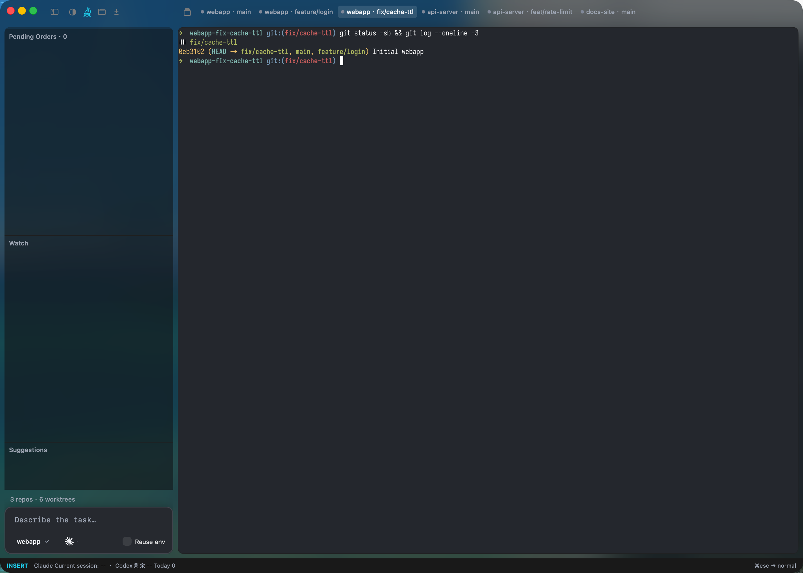
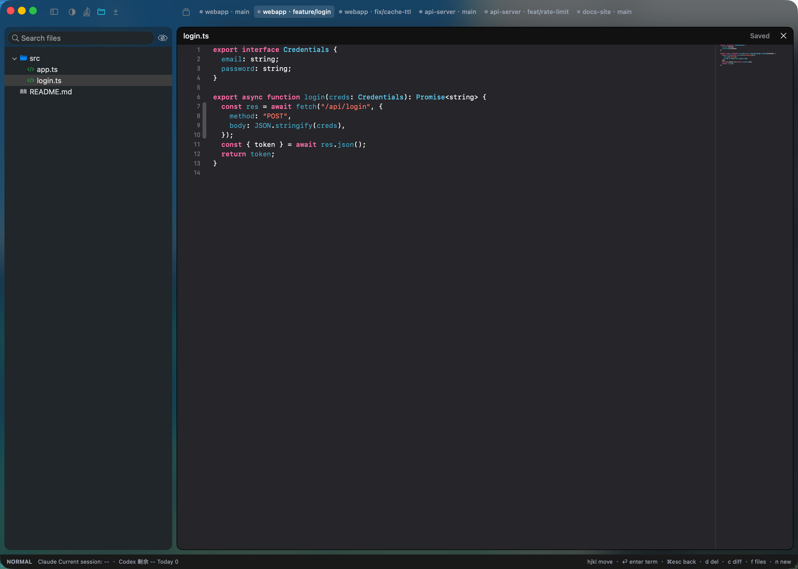
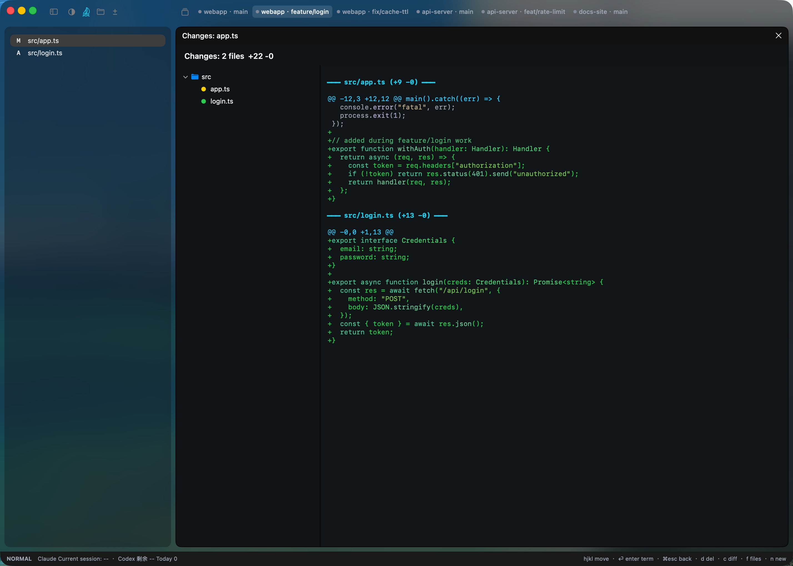

# Seahelm

**A native macOS workspace for coding agents, git worktrees, and parallel development.**

**一个为 coding agent、git worktree 和并行开发准备的原生 macOS 工作台。**

Seahelm brings the moving parts of modern AI-assisted development into one place: repos, worktrees, panes, agent runs, diffs, prompts, and notifications.

当开发日常变成多个仓库、多个分支、多个 worktree、多个 agent 同时推进时，Seahelm 用一个原生 macOS 界面把这些上下文整理到一起。

Install / 安装：

```bash
curl -fsSL https://raw.githubusercontent.com/BetaYao/seahelm/main/scripts/install.sh | sh
```

Or download manually / 或手动下载：
[`Apple Silicon`](https://github.com/BetaYao/seahelm/releases/latest) · [`Intel`](https://github.com/BetaYao/seahelm/releases/latest)

## Screenshots

### Workspace



Every repo and worktree as a tab, a live terminal, and the sidebar — one place to drive parallel work.

每个仓库和 worktree 都是一个 tab，配上实时终端和侧边栏，并行开发集中在一个界面里操作。

### File browser & code editor



Browse the worktree's file tree and read code with syntax highlighting — without leaving Seahelm.

直接浏览 worktree 的文件树、带语法高亮地阅读代码，不用切到别的编辑器。

### Git diff review



Review what changed in a worktree, file by file, right next to the terminal.

在终端旁边逐个文件审查 worktree 的改动。

## 中文

### 产品定位

Seahelm 面向的是一种已经很常见的开发方式：

- 一个个终端窗口来回切
- 一堆 worktree 散落在 Finder 和 shell 里
- agent 在跑、在等、已经挂了，靠肉眼盯着看
- 收到通知时，只知道"有事发生了"，却不知道是哪一个 pane、哪一个分支、哪一次任务

你不缺终端，你缺的是一个能把这些终端、分支、agent 和状态组织起来的界面。

### 它是怎么工作的

Seahelm 不打算替代终端。

它更像是给这套工作流补上一层产品化的操作界面：

- 你可以同时管理多个仓库和多个 git worktree
- 你可以在一个 worktree 里拆多个 pane，让多个 agent 并行推进
- 你可以更快看见谁在运行、谁在等你、谁已经完成、谁真的失败了
- 你可以直接在侧边栏浏览文件树、阅读代码、预览 Markdown、审查 git diff，而不必离开当前 worktree
- 你可以从通知直接回到对应上下文，而不是重新找窗口、找 tab、找目录

重点不是把更多信息堆到屏幕上，而是让并行开发这件事变得更清楚、更轻松。

### 核心体验

- 原生 macOS 体验，不是 Electron 套壳
- 基于 Ghostty 的终端能力，保留终端工作流的速度和手感
- Dashboard 一屏总览所有 worktree、agent 和状态
- Focus Panel 支持 split pane，让一个 worktree 也能自然并行
- 侧边栏内置文件树、代码编辑器（CodeEditSourceEditor）、Markdown 预览和 git diff 审查
- 通知按 pane 精确归因，不再是模糊的"某个任务完成了"
- Notification History 保留刚刚发生了什么，并支持快速跳回现场
- 全键盘导航，三种模式，手不用离开键盘
- 会话由 [zmx](https://zmx.sh) 持久化：关掉 app、重启机器，pane 里的 agent 还在原地（zmx 不可用时自动降级为普通进程，只是不再跨重启保留）

### 灵动岛（Island）

屏幕顶部常驻一颗药丸。平时它只是一个安静的状态指示，有事时才展开：

- 哪个 worktree 在跑、在等你、出错了，扫一眼就够
- agent 给出的下一步建议会弹成卡片，选项是可点的按钮
- 内置命令输入框，不用先切回主窗口
- 点击直接跳回对应的 pane 现场

### First Mate：把"下一步"变成按钮

Seahelm 会观察每个 pane 的状态迁移（谁停下了、谁在等输入、谁出错了），按规则生成建议卡片：

- **suggestion / AskUserQuestion 卡片** — agent 结束一轮时给出的候选下一步，点一下就把对应文本打进**发出建议的那个 pane**
- **等待 / 报错提醒** — 长时间无人处理的 pane 主动浮上来
- **Return to port** — worktree 干净且已合并时，提示回收；脏的或未合并的需要显式确认

### 支持的 agent

状态识别通过 `Resources/Manifests/` 下的清单驱动，目前覆盖 11 种：agent、aider、amp、claude、cline、codex、cursor、gemini、goose、kiro、opencode。

深度集成（能主动上报事件、能给出建议卡片）的程度不同：

| Agent | 状态识别 | Hook 上报 | 建议卡片 |
|---|---|---|---|
| Claude Code | ✅ | ✅ 原生 hooks | ✅ |
| Codex | ✅ | ✅ 原生 hooks | ✅ |
| opencode | ✅ | ✅ 插件 | ⚠️ 见下 |
| 其他 8 种 | ✅ 仅靠屏幕识别 | — | — |

opencode 的插件 API 没有 Claude 那样的 Stop hook，所以 Seahelm 装的是一个插件，注册一个原生 `seahelm_suggest` 工具让模型主动调用——拿不到"回合结束时反向逼问一次"的能力，建议卡片依赖模型自觉。

### 控制接口：agent 可以自己开 pane

Seahelm 起了一个控制 socket（默认 `~/.config/seahelm/seahelm.sock`，可用 `SEAHELM_SOCKET_PATH` 覆盖），并安装一个 `seahelm` CLI 到 `~/.local/bin/`。pane 里的 agent 能用它驱动 Seahelm 本身：

```bash
seahelm pane list                                  # 有哪些 pane
seahelm pane read <pane> --lines 50                # 读某个 pane 的屏幕
seahelm pane split <pane> --direction right        # 开一个兄弟 pane
seahelm pane run <pane> "npm test"                 # 往某个 pane 打命令
seahelm wait agent-status <pane> --status Idle     # 阻塞等它跑完
seahelm pane explain <pane>                        # 这个状态是哪条规则判出来的？
seahelm layout export                              # 导出当前分屏布局
```

完整命令：`seahelm <ping|session|pane|wait|events|layout>`。其中 `pane explain` 在排查状态识别问题时特别有用——直接问 app 用了哪个清单、命中哪条规则，不用去读检测代码。

每个 pane 都拿得到自己的 `SEAHELM_PANE_ID`，所以 agent 可以引用"我自己"或某个兄弟 pane。配套还会装一个 agent skill，让 agent 知道这些能力怎么用。

### 手机上的另一块屏

Seahelm 可以把 agent 的消息和建议推到企业微信 / 微信，并接受从手机发回的指令——同一套命令语言，桌面和手机一致。人不在电脑前时，agent 停下来等你的那一刻不至于白等。

### Token 用量

Claude 和 Codex 的 token / 额度用量会被汇总展示，不用另开一个工具去查。

### 适合的人

- 重度使用 coding agent 的开发者
- 同时维护多个分支、多个 worktree 的个人和团队
- 已经把 AI 辅助编程放进日常工作流的人

### 为什么不是 Terminal + tmux

当然，你也可以继续用终端、tmux、worktree 和手动切换来管理一切。

但当任务开始并行、agent 开始增多、通知开始变得频繁时，纯命令行方案很快会暴露出几个问题：

- 状态是分散的，不是聚合的
- 通知是碎片化的，不是可导航的
- pane 在跑什么、哪个分支需要你、哪个任务刚结束，需要你自己拼上下文

Seahelm 不是替代终端，而是让这套终端工作流更像一个完整产品，而不是一组零散工具。

### 下载

如果你只是想直接试用，一行命令安装（自动识别架构，装到 /Applications）：

```bash
curl -fsSL https://raw.githubusercontent.com/BetaYao/seahelm/main/scripts/install.sh | sh
```

或手动安装：

- 打开 [GitHub Releases](https://github.com/BetaYao/seahelm/releases/latest)
- 下载对应架构的 `seahelm-macos-arm64.zip` 或 `seahelm-macos-x86_64.zip`
- 解压，把 `seahelm.app` 拖入「应用程序」并启动

### 本地开发

从 `project.yml` 生成 Xcode 工程（需要 [XcodeGen](https://github.com/yonaskolb/XcodeGen)）：

```bash
xcodegen generate
```

本地构建（`CodeEditSourceEditor` 引入了 SwiftLint 构建插件，命令行构建需要跳过插件校验）：

```bash
xcodebuild -project seahelm.xcodeproj -scheme seahelm \
  -configuration Debug -skipPackagePluginValidation -skipMacroValidation build
```

构建并启动（产物在 `.build/`）：

```bash
./run.sh
```

运行 UI 测试：

```bash
./run_ui_tests.sh
```

打当前机器架构的 release 包：

```bash
./scripts/package_release.sh
```

产物会输出到 `dist/`。

### 架构

Swift + AppKit，macOS 14.0+，四层结构：

- **App coordinators**（`Sources/App/`）持有窗口、tab、split pane 和侧边面板
- **UI 层**（`Sources/UI/`）渲染 dashboard、灵动岛、分屏、标题栏和 worktree 侧边栏
- **核心服务**（`Sources/Core/`、`Sources/Status/`）负责 agent 状态跟踪、状态识别流水线、First Mate 规则引擎和控制 socket
- **终端与系统**（`Sources/Terminal/`、`Sources/Git/`）封装 Ghostty C API 和 git worktree 发现

详细架构见 [`CLAUDE.md`](CLAUDE.md)，设计文档见 [`docs/`](docs/)。

### 发布

仓库已经包含 [`.github/workflows/release.yml`](.github/workflows/release.yml)。

- 推送 `v2.0.0` 这类 tag 会触发 release workflow
- workflow 会分别构建 `arm64` 和 `x86_64` 的 macOS 包
- 最终上传 `seahelm-macos-arm64.zip` 和 `seahelm-macos-x86_64.zip`

如果配置了下面这些 secrets，workflow 还会自动签名、notarize、staple：

- `APPLE_CERTIFICATE_P12`
- `APPLE_CERTIFICATE_PASSWORD`
- `APPLE_DEVELOPER_IDENTITY`
- `APPLE_ID`
- `APPLE_APP_SPECIFIC_PASSWORD`
- `APPLE_TEAM_ID`

### 发布流程

1. 提交并推送到默认分支。
2. 创建并推送 tag，比如 `git tag v2.0.0 && git push origin v2.0.0`。
3. 等待 `Release` workflow 完成——发布版本号取自 tag。
4. 检查 GitHub Release 里的产物和说明。

## English

### Positioning

Seahelm is built for a workflow that is becoming normal:

- too many terminal windows
- too many loose worktrees
- too many parallel agent runs with no clear status model
- too many notifications that tell you something happened, but not where or why

What used to be a few terminal tabs is now multiple repos, multiple worktrees, multiple agent runs, and constant context switching.

Seahelm turns that into a workspace you can actually operate from.

### How It Works

- Native macOS app, built for speed and clarity
- Ghostty-backed terminal surfaces
- A dashboard that shows the real state of your active work
- Split panes inside a worktree so multiple agents can move in parallel
- A side panel with a file tree, an embedded code editor, Markdown preview, and git diff review — without leaving the current worktree
- Status aggregation that makes it easier to see what needs attention
- Notification history that lets you jump back into context
- System notifications tied to the actual pane and recent prompt
- Full-keyboard navigation across three modes
- Sessions persisted by [zmx](https://zmx.sh): quit the app or reboot, and the agent is still where you left it (falls back to plain processes when zmx is unavailable — you just lose persistence)

### The Island

A pill sits at the top of your screen. It stays quiet until something needs you, then expands:

- which worktree is running, waiting on you, or broken — at a glance
- an agent's suggested next steps arrive as a card with clickable option buttons
- a built-in command composer, so you don't have to go find the main window first
- click through to land in the pane the event came from

### First Mate: next steps as buttons

Seahelm watches each pane's status transitions — who stopped, who is waiting for input, who errored — and turns them into cards:

- **Suggestion / AskUserQuestion cards** — the candidate next steps an agent offers at the end of a turn. Tap one and the text is typed into **the pane that raised it**.
- **Waiting / error watches** — a pane nobody has attended to surfaces itself.
- **Return to port** — offers to reap a worktree once it is clean and merged; dirty or unmerged ones require explicit confirmation.

### Agent support

Status detection is manifest-driven (`Resources/Manifests/`) and covers 11 agents today: agent, aider, amp, claude, cline, codex, cursor, gemini, goose, kiro, opencode.

How deeply each is integrated varies:

| Agent | Status detection | Event hooks | Suggestion cards |
|---|---|---|---|
| Claude Code | ✅ | ✅ native hooks | ✅ |
| Codex | ✅ | ✅ native hooks | ✅ |
| opencode | ✅ | ✅ plugin | ⚠️ see below |
| the other 8 | ✅ screen-scan only | — | — |

opencode's plugin API has no Claude-shaped Stop hook, so Seahelm installs a plugin that registers a native `seahelm_suggest` tool for the model to call. There is no way to block a turn and ask for suggestions after the fact — the cards depend on the model volunteering them.

### Control interface: agents can drive Seahelm

Seahelm listens on a control socket (`~/.config/seahelm/seahelm.sock` by default, override with `SEAHELM_SOCKET_PATH`) and installs a `seahelm` CLI into `~/.local/bin/`. An agent running inside a pane can use it to drive Seahelm itself:

```bash
seahelm pane list                                  # what panes exist
seahelm pane read <pane> --lines 50                # read a pane's screen
seahelm pane split <pane> --direction right        # open a sibling pane
seahelm pane run <pane> "npm test"                 # type a command into a pane
seahelm wait agent-status <pane> --status Idle     # block until it finishes
seahelm pane explain <pane>                        # which rule decided this status?
seahelm layout export                              # capture the current split layout
```

The full surface is `seahelm <ping|session|pane|wait|events|layout>`. `pane explain` is the fastest way to debug status detection — ask the app which manifest and which rule decided, instead of reading the detection code.

Every pane gets its own `SEAHELM_PANE_ID`, so an agent can refer to itself or to a sibling. An agent skill is installed alongside, so agents know these commands exist.

### A second screen in your pocket

Seahelm can push agent messages and suggestions to WeCom / WeChat and accept commands sent back — one command language across desktop and phone. When you are away from the machine, an agent that stopped to ask you something doesn't have to wait for you to come back.

### Token usage

Token and quota usage for Claude and Codex is summarized in-app, so you don't need a separate tool to check.

### Who It Is For

- Developers already working with Claude Code, Codex, or similar coding agents
- People managing multiple branches and worktrees every day
- Teams using AI-assisted coding as part of regular development

### Why Not Terminal + tmux

You can keep using terminals, tmux sessions, worktrees, and manual context switching.

But once agent runs become parallel and notifications become constant, the cracks show:

- status is scattered instead of aggregated
- notifications are noisy instead of navigable
- context lives in your head instead of the interface

Seahelm does not replace the terminal. It gives that workflow a cleaner surface to live in.

### Download

If you just want to try it, install with one line (detects your architecture, installs into /Applications):

```bash
curl -fsSL https://raw.githubusercontent.com/BetaYao/seahelm/main/scripts/install.sh | sh
```

Or manually:

- Open [GitHub Releases](https://github.com/BetaYao/seahelm/releases/latest)
- Download `seahelm-macos-arm64.zip` or `seahelm-macos-x86_64.zip`
- Unzip it, drag `seahelm.app` into Applications, and launch it

### Local Development

Generate the Xcode project from `project.yml` (requires [XcodeGen](https://github.com/yonaskolb/XcodeGen)):

```bash
xcodegen generate
```

Build locally (`CodeEditSourceEditor` pulls in the SwiftLint build-tool plugin, so headless builds must skip plugin validation):

```bash
xcodebuild -project seahelm.xcodeproj -scheme seahelm \
  -configuration Debug -skipPackagePluginValidation -skipMacroValidation build
```

Build and launch (artifacts land in `.build/`):

```bash
./run.sh
```

Run UI tests:

```bash
./run_ui_tests.sh
```

Build a release zip for the current machine architecture:

```bash
./scripts/package_release.sh
```

Artifacts are written to `dist/`.

### Architecture

Swift + AppKit, macOS 14.0+, four layers:

- **App coordinators** (`Sources/App/`) own the window, tabs, split panes, and side panels
- **UI layer** (`Sources/UI/`) renders the dashboard, the island, splits, title bar, and the worktree side panel
- **Core services** (`Sources/Core/`, `Sources/Status/`) drive agent-state tracking, the status-detection pipeline, the First Mate rules engine, and the control socket
- **Terminal & system** (`Sources/Terminal/`, `Sources/Git/`) wrap the Ghostty C API and git worktree discovery

See [`CLAUDE.md`](CLAUDE.md) for a detailed architecture overview and [`docs/`](docs/) for design notes.

### Releases

This repository includes [`.github/workflows/release.yml`](.github/workflows/release.yml).

- Pushing a tag like `v2.0.0` triggers the release workflow
- The workflow builds both `arm64` and `x86_64` macOS artifacts
- It publishes `seahelm-macos-arm64.zip` and `seahelm-macos-x86_64.zip` to the GitHub Release

If the following repository secrets are configured, the workflow will also sign, notarize, and staple the app:

- `APPLE_CERTIFICATE_P12`
- `APPLE_CERTIFICATE_PASSWORD`
- `APPLE_DEVELOPER_IDENTITY`
- `APPLE_ID`
- `APPLE_APP_SPECIFIC_PASSWORD`
- `APPLE_TEAM_ID`

### Release Process

1. Commit and push to the default branch.
2. Create and push a tag, for example `git tag v2.0.0 && git push origin v2.0.0`.
3. Wait for the `Release` workflow to finish — the shipped version is derived from the tag.
4. Verify the GitHub Release assets and notes.
