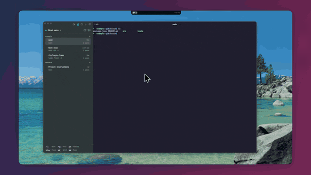
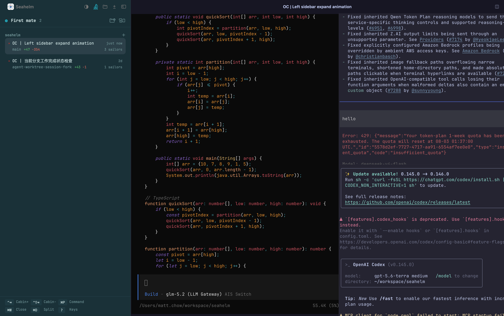
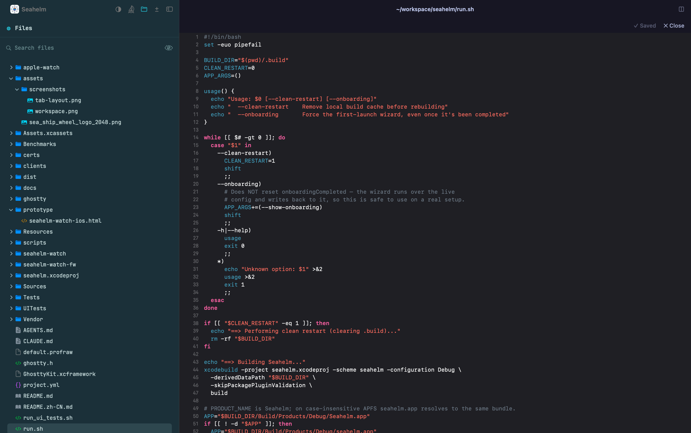

# Seahelm

A native macOS workspace for coding agents, git worktrees, and parallel development.

[中文文档](README.zh-CN.md)

## Demo



Full walkthrough: [YouTube](https://youtu.be/WUUcuglx_Ks)

## Why Seahelm

- **Minimal** — No bloated code editor or diff review. Everything is delegated to agents; the UI stays out of the way.
- **Fast** — Native macOS, built on the Ghostty terminal and AppKit. Low latency, responsive rendering.
- **Compatible** — Works with up to 12 coding agents out of the box. Not locked into any single platform.

## Install

```bash
curl -fsSL https://raw.githubusercontent.com/BetaYao/seahelm/main/scripts/install.sh | sh
```

Or download from [GitHub Releases](https://github.com/BetaYao/seahelm/releases/latest).

## Screenshots

### Workspace



### File browser & code editor



### Tab layout


## Features

**Workspace & panes** — Manage multiple repos and git worktrees as tabs. Split panes inside a worktree so multiple agents run in parallel.

**Agent status** — Manifest-driven status detection covers 12 agents: agent, aider, amp, claude, cline, codex, cursor, gemini, goose, kiro, opencode, pi. Claude Code and Codex have native hook integration with suggestion cards.

| Agent | Status detection | Event hooks | Suggestion cards |
|---|---|---|---|
| Claude Code | ✅ | ✅ native hooks | ✅ |
| Codex | ✅ | ✅ native hooks | ✅ |
| opencode | ✅ | ✅ plugin | ⚠️ model-volunteered |
| Others (9) | ✅ screen-scan | — | — |

**Side panel** — File tree, code editor (CodeEditSourceEditor), Markdown preview, and git diff review without leaving the worktree.

**The Island** — A status pill at the top of the screen. Stays quiet until a worktree needs you: running, waiting, or broken. Agent suggestions arrive as clickable cards.

**First Mate** — Watches pane state transitions and generates cards: suggestions, waiting/error alerts, and "return to port" cleanup prompts.

**Control socket** — Agents can drive Seahelm via a CLI:

```bash
seahelm pane list
seahelm pane read <pane> --lines 50
seahelm pane split <pane> --direction right
seahelm pane run <pane> "npm test"
seahelm wait agent-status <pane> --status Idle
seahelm pane explain <pane>       # which rule decided this status?
seahelm layout export
```

Every pane gets `SEAHELM_PANE_ID` for self-reference. Full surface: `seahelm <ping|session|pane|wait|events|layout>`.

**Token usage** — Claude and Codex token/quota usage summarized in-app.

**Sessions** — Persisted by [zmx](https://zmx.sh). Quit the app or reboot, and the agent is still where you left it. Falls back to plain processes when zmx is unavailable.

## Who It's For

- Developers working with Claude Code, Codex, or similar coding agents
- People managing multiple branches and worktrees daily
- Teams using AI-assisted coding in regular development

## Local Development

Requires [XcodeGen](https://github.com/yonaskolb/XcodeGen):

```bash
xcodegen generate
```

Build (`CodeEditSourceEditor` requires skipping plugin validation):

```bash
xcodebuild -project seahelm.xcodeproj -scheme seahelm \
  -configuration Debug -skipPackagePluginValidation -skipMacroValidation build
```

Build and launch (artifacts in `.build/`):

```bash
./run.sh
```

Run UI tests:

```bash
./run_ui_tests.sh
```

Package a release zip for the current architecture:

```bash
./scripts/package_release.sh   # → dist/
```

## Architecture

Swift + AppKit, macOS 14.0+, four layers:

- **App coordinators** (`Sources/App/`) — window, tabs, split panes, side panels
- **UI layer** (`Sources/UI/`) — dashboard, island, splits, title bar, worktree sidebar
- **Core services** (`Sources/Core/`, `Sources/Status/`) — agent state tracking, status detection pipeline, First Mate rules engine, control socket
- **Terminal & system** (`Sources/Terminal/`, `Sources/Git/`) — Ghostty C API, git worktree discovery

See [`CLAUDE.md`](CLAUDE.md) for details and [`docs/`](docs/) for design notes.

## Releases

Pushing a `v*` tag triggers the release workflow, which builds `arm64` and `x86_64` macOS artifacts.

With repository secrets configured (`APPLE_CERTIFICATE_P12`, `APPLE_DEVELOPER_IDENTITY`, `APPLE_ID`, `APPLE_TEAM_ID`, etc.), the workflow also signs, notarizes, and staples the app.
