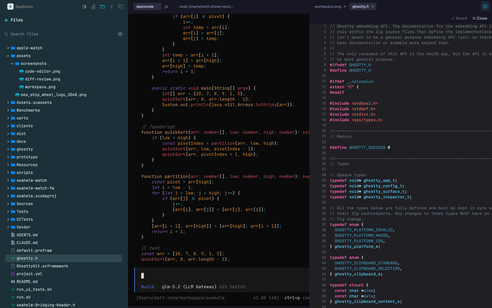

# Seahelm

一个为 coding agent、git worktree 和并行开发准备的原生 macOS 工作台。

[English](README.md) · [网站](https://www.seahelm.dev/zh/)

## Demo


完整演示：[YouTube](https://youtu.be/WUUcuglx_Ks)

## 为什么选择 Seahelm

macOS 上并行跑 coding agent 的工具已经不止一个。相同的部分 Seahelm 并不回避：Swift、
libghostty、每个 agent 一个 git worktree、用 hook 上报状态。真正属于自己的有三点。

**它活在终端之外。** 多路复用器把状态放在你正想别再盯着的那个窗口里。Seahelm 的 Island
停在屏幕边缘，只有 worktree 需要你时才出声；被卡住的 agent 会触发真正的系统通知；你还能
用 iMessage 从手机上回复它。Claude 和 Codex 的 token 与额度消耗也在 App 里汇总，所以你
能提前看到某个 agent 快把预算跑光，而不是等它停下来才知道。

**围绕决策设计，而不是围绕展示。** Seahelm 从 Stop hook 上报的最终回复里读取 agent 给出的
下一步选项，把行内标记变成可点击的卡片。First Mate 监听状态变化，要么自动处理，要么排进
待批准队列。显示「正在等你」是容易的那一半，难的是接下来该做什么。

**pane 跟着它的 agent 走。** 当一个 agent 创建了新的 worktree 并开始在里面工作，这个
pane 会迁移到新 worktree 的卡片上，而不是在旁边多出一个空终端。依据是每个 hook 负载都
携带的 cwd，配合同仓库判定和冷却时间，这样 agent 执行 `cd x && ...` 这类单次调用不会
把 pane 来回拖动。

除此之外：基于 Ghostty 引擎的原生渲染而非 Electron、通过 zmx 让会话在重启后依然存活、
开箱支持 12 种 agent 的状态识别。

## 它是怎么写出来的

Seahelm 是 vibe coding 的产物。几乎每一行都由 coding agent 写成 —— Claude Code 和
Codex —— 我把控的是「应该发生什么」，而不是逐行审阅 diff。它还是在自己身上长出来的：
下面讲的 worktree、split pane 和状态检测，正是由跑在 Seahelm 自己的 worktree、split
pane 里、被它自己的状态检测盯着的 agent 写出来的。

安装前值得知道：

- 代码公开且是 MIT，所以你可以自己读，而不必听它自说自话。
- 约 1900 个单元测试覆盖了那些事先能说清楚的行为。说不清楚的那部分，就是 bug 待的地方。
- 带复现步骤的 bug 报告是你能给的最有用的东西 —— 它是把毛刺变成修复的关键。

## 安装

```bash
curl -fsSL https://seahelm.dev/install.sh | sh
```

或从 [GitHub Releases](https://github.com/BetaYao/seahelm/releases/latest) 手动下载。

## 截图

### Workspace


### 文件浏览 & 代码编辑


### 编辑模式



## 功能

**工作区 & 分屏** — 多个仓库和 git worktree 各为一个 tab,worktree 内可拆分 pane 让多个 agent 并行推进。

**Agent 状态** — 清单驱动的状态识别,覆盖 12 种 agent:agent、aider、amp、claude、cline、codex、cursor、gemini、goose、kiro、opencode、pi。Claude Code 和 Codex 有原生 hook 集成和建议卡片。

| Agent | 状态识别 | Hook 上报 | 建议卡片 |
|---|---|---|---|
| Claude Code | ✅ | ✅ 原生 hooks | ✅ |
| Codex | ✅ | ✅ 原生 hooks | ✅ |
| opencode | ✅ | ✅ 插件 | ⚠️ 依赖模型自觉 |
| 其他 9 种 | ✅ 屏幕识别 | — | — |

**侧边栏** — 文件树、代码编辑器(CodeEditSourceEditor)、Markdown 预览、git diff 审查,不离开当前 worktree。

**灵动岛** — 屏幕顶部常驻胶囊,平时安静,有事才展开:哪个 worktree 在跑、在等你、出错了。agent 建议弹成可点卡片。

**First Mate** — 观察 pane 状态迁移,生成建议卡片、等待/报错提醒、worktree 回收提示。

**控制接口** — agent 可通过 CLI 驱动 Seahelm:

```bash
seahelm pane list
seahelm pane read <pane> --lines 50
seahelm pane split <pane> --direction right
seahelm pane run <pane> "npm test"
seahelm wait agent-status <pane> --status Idle
seahelm pane explain <pane>       # 这个状态是哪条规则判出来的?
seahelm layout export
```

每个 pane 拿到 `SEAHELM_PANE_ID`。完整命令:`seahelm <ping|session|pane|wait|events|layout>`。

**Token 用量** — Claude 和 Codex 的 token/额度用量在 app 内汇总展示。

**会话持久化** — 由 [zmx](https://zmx.sh) 持久化:关掉 app、重启机器,agent 还在原地。zmx 不可用时降级为普通进程。

## 适合的人

- 重度使用 coding agent 的开发者
- 同时维护多个分支、多个 worktree 的个人和团队
- 已把 AI 辅助编程放进日常工作流的人

## 本地开发

需要 [XcodeGen](https://github.com/yonaskolb/XcodeGen):

```bash
xcodegen generate
```

构建(`CodeEditSourceEditor` 需跳过插件校验):

```bash
xcodebuild -project seahelm.xcodeproj -scheme seahelm \
  -configuration Debug -skipPackagePluginValidation -skipMacroValidation build
```

构建并启动(产物在 `.build/`):

```bash
./run.sh
```

运行 UI 测试:

```bash
./run_ui_tests.sh
```

打当前架构的 release 包:

```bash
./scripts/package_release.sh   # → dist/
```

## 架构

Swift + AppKit,macOS 14.0+,四层结构:

- **App coordinators**(`Sources/App/`)— 窗口、tab、split pane、侧边面板
- **UI 层**(`Sources/UI/`)— dashboard、灵动岛、分屏、标题栏、worktree 侧边栏
- **核心服务**(`Sources/Core/`、`Sources/Status/`)— agent 状态跟踪、状态识别流水线、First Mate 规则引擎、控制 socket
- **终端与系统**(`Sources/Terminal/`、`Sources/Git/`)— Ghostty C API、git worktree 发现

详见 [`CLAUDE.md`](CLAUDE.md),设计文档见 [`docs/`](docs/)。

## 发布

推送 `v*` tag 触发 release workflow,构建 `arm64` 和 `x86_64` macOS 产物。

配置仓库 secrets(`APPLE_CERTIFICATE_P12`、`APPLE_DEVELOPER_IDENTITY`、`APPLE_ID`、`APPLE_TEAM_ID` 等)后,workflow 会自动签名、notarize、staple。

## 许可

Seahelm 以 [MIT License](LICENSE) 发布。

本项目建立在他人的工作之上 —— 主要是 [Ghostty](https://github.com/ghostty-org/ghostty)
终端引擎(MIT)和负责会话持久化的 [zmx](https://zmx.sh)。捆绑的 Swift 包分别采用
MIT、BSD-3-Clause 或 Apache-2.0 协议,各自保留其版权与许可。

随 app 分发的第三方组件 —— Ghostty、zmx、Sparkle 及各 Swift 包 —— 及其完整协议原文
见 [`THIRD-PARTY-NOTICES.md`](THIRD-PARTY-NOTICES.md)。
