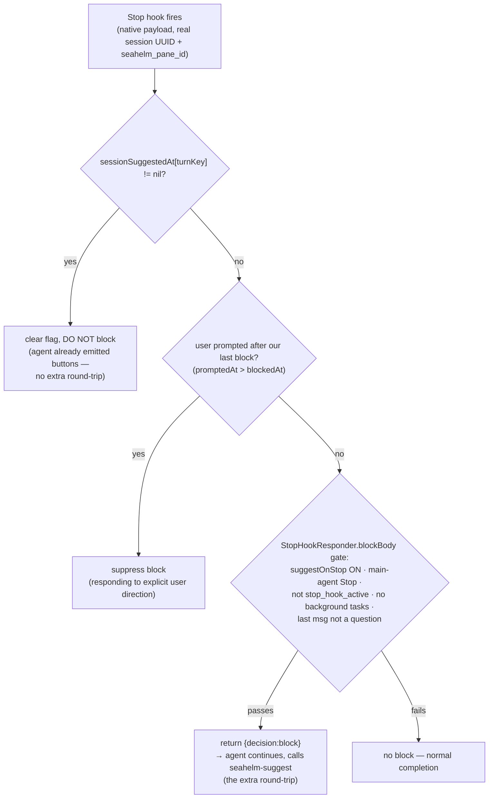

# Suggestion Flow (seahelm-suggest)

How next-step suggestion buttons are produced and rendered on a pane's
First Mate card. Design is **instruction-primary, Stop-hook fallback**: in the
normal case the agent emits its own suggestions and the Stop hook does nothing.

## Correlation key

The suppression state that ties "agent already suggested this turn" to "the
Stop that follows" is keyed by **`turnKey = paneId ?? sessionId`**, NOT by
session id. A native Stop hook carries Claude's real session UUID, while the
agent-invoked `seahelm-suggest` only knows its `pane_id`; keying by session id
made them never match, so the fallback block fired every turn. See
`TabCoordinator.handleEvent` and `ControlProtocol` `case "suggest"`.

## Primary path — agent self-suggests each turn

```mermaid
flowchart TD
    A["Agent, as its last action,\ncalls: seahelm-suggest 'opt1' 'opt2' ..."] --> B["seahelm-suggest CLI\n→ unix socket\nmethod:suggest {pane_id, cwd, options}"]
    B --> C["ControlProtocol case \"suggest\"\nsynthesize .suggest WebhookEvent\n(carries seahelm_pane_id)"]
    C --> D["TabCoordinator.handleEvent\nturnKey = paneId ?? sessionId"]
    D --> E{"background busy?\n(subagent / shell / cron)"}
    E -- yes --> F["DROP suggest\n(agent will auto-resume,\nnot really end-of-turn)"]
    E -- no --> G["sessionSuggestedAt[turnKey] = now\n(mark: suggested this turn)"]
    G --> H["ShipLog.handleWebhookEvent\nresolve terminal by cwd → worktree"]
    H --> I["FirstMate rule engine\n→ red-zone suggestNextOrder card\n(options + last assistant msg summary)"]
    I --> J["UI renders clickable buttons"]
```

## Fallback path — Stop hook

Fires when the agent's turn ends. Decision order inside `handleEvent`:



Before the pane-id fix, branch `T` never matched, so essentially every real
end-of-turn Stop fell through to `Y` and forced a wasted round-trip.

## Reset — what defines "a turn"

`sessionSuggestedAt[turnKey]` is cleared on each new `.userPrompt`. A fresh user
message starts a new turn, so the agent must suggest again.

## Viewport choices — permission prompts and `pane.options`

`SeahelmControlDataSource.paneOptions(paneId:)` reads the pane's **live viewport
text** and parses on-screen choices via `ChoiceOptionParser` (Happy-style
detection of permission prompts / AskUserQuestion). The status poller uses the
same parser to emit a screen-native question event, which becomes a First Mate
card on desktop. Picking a card option drives the original TUI with arrow keys
and Return. Wrapped labels and confirmation footers after the option list are
supported. This remains a separate channel from the `seahelm-suggest` hook
events described above.
